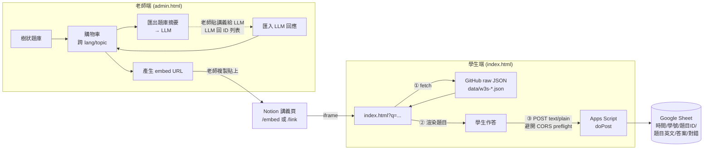

# Notion 嵌入式互動練習 + Google Sheets 作答紀錄

## Context

目前 repo 是純資料 + 爬蟲：`data/w3s-<lang>-{challenges,exercises,quiz}.json` 內含 8 種語言的 W3Schools 題庫，多數題目已有 zh-tw 翻譯（`prompt_zh` / `answer_zh`），但**沒有任何學生互動介面**。老師需要在 Notion 「web2026」講義頁裡讓學生做題，並把作答紀錄收回 Google Sheet。直接內嵌 W3Schools 原網站不行（`X-Frame-Options` 擋 iframe，且作答結果無法收回 Sheet），所以必須自己渲染題目 UI。

本計畫新增 `web/`（GitHub Pages 託管的靜態前端）+ `apps-script/Code.gs`（薄薄一支寫 Sheet 的 GAS 腳本），讓老師可以從題庫挑題 → 產出 embed URL → 貼進 Notion；學生作答即時寫進 Sheet。

## 範圍校正（必讀）

驗證 `data/` 後對原構想的調整：

| 原構想 | 校正 | 原因 |
|---|---|---|
| `TYPES = ['ex', 'chal']` | **`TYPES = ['ex']` only** | 全部 115 題 challenges 都是程式碼+regex 題（`{id, intro, starter, solution, requirements}`），**0 題 MCQ**。chal 樹會全空。 |
| URL 支援 quiz ID | **v1 不支援 quiz** | quiz JSON 是 `{test, total, questions: []}`（無 topics），且除 `c-quiz` 外 `correct` 全為 null。LLM import 的 regex 要剔除 quiz alternation。 |
| `parseId` regex `(\w+):(\w+):(\w+):(\d+)` | topic 段改 `[\w-]+` | 11 個 topic 含連字號（`css3_box-sizing`、`inline-block`、`max-width`、`z-index`、`computed-properties`、`lifecycle-hooks`、`provide-inject`…）。原 regex 抓不到。 |
| 8 種語言全部支援 | **Vue 在 v1 實質為空** | `w3s-vue-exercises.json` 100% 是 fillintheblanks（54 題、0 MCQ）。樹仍列出但點進去沒題。可保留（之後做 fitb 渲染就能用），或暫時從 `LANGS` 拿掉。建議保留。 |
| dragdrop / fitb 題型 | v1 不渲染 | 原計畫已說明。`isMcq` filter `typeof q.correct === 'number' && Array.isArray(q.options)` 正確排除這兩種。 |

可用 MCQ 題量（驗證後）：HTML 84、CSS 383、JS 184、C 240、Node.js 94、SQL 205、Git 47、Vue 0 ＝ 約 1237 題，足夠混合練習。

## 整體架構



## 檔案佈局

```
web/                    ← 新增（GitHub Pages root 指這裡）
  index.html            學生端：學號 + 題目卡 + 提交
  quiz.js               學生端邏輯
  admin.html            老師端：3 欄（樹/題目/購物車）
  admin.js              老師端邏輯
  lib.js                共用：fetch 題庫、parseId、isMcq
  style.css             共用樣式
  README.md             部署指引（GAS_URL 與 GitHub Pages 設定）
apps-script/            ← 新增（GAS 編輯器同步備份）
  Code.gs               doPost 寫 Sheet
```

## 實作順序與步驟

### 1. `web/lib.js` — 共用模組（先做，後面兩端都依賴它）

匯出常數：
- `REPO_RAW = 'https://raw.githubusercontent.com/<user>/<repo>/main/data'`（README 標註要替換）
- `TYPE_MAP = { ex: 'exercises' }`（v1 只一項，但保留 map 結構利於未來擴充）
- `LANGS = ['html', 'css', 'js', 'c', 'nodejs', 'sql', 'git', 'vue']`

匯出函式：
- `loadJson(lang, type)`：fetch `${REPO_RAW}/w3s-${lang}-${TYPE_MAP[type]}.json`，**模組級 cache** 避免同 lang/type 重複下載。
- `parseId(s)`：regex `/^([a-z]+):(ex):([\w-]+):(\d+)$/`（注意 topic 含 `-`、type 限定 `ex`）。回傳 `{lang, type, topic, idx, id} | null`。
- `isMcq(q)`：`Array.isArray(q.options) && typeof q.correct === 'number' && typeof q.question === 'string'`（排除 dragdrop 的 `correct: number[]` 與 fitb）。
- `loadQuestionsByIds(idStrings)`：parse → 用 `loadJson` 取 `data.topics[topic][idx]` → 過 `isMcq` → 失敗 `console.warn` 跳過，不報錯。

### 2. `apps-script/Code.gs`（GAS 編輯器同步備份）

- 常數 `SHEET_ID`（README 標註要填）
- `doPost(e)`：parse `{studentId, answers: [{id, questionEn, selected, correct}]}`；驗證學號 `^[A-Za-z0-9]{4,15}$`；批次 `getRange(...).setValues(rows)` 寫入；回 `{ok, count}` JSON。
- `doGet()`：回 `{ok: true}`，方便老師瀏覽器測連通。
- 不接受 preflight：學生端用 `Content-Type: text/plain`、不加自訂 header（simple request）。GAS 端 `JSON.parse(e.postData.contents)` 仍能解。
- README 寫部署步驟：新建 Sheet → 記下 ID → 部署為 Web App（執行身分=我、存取權=任何人）→ 把 `/exec` URL 填回 `web/quiz.js`。

### 3. `web/index.html` + `web/quiz.js` — 學生端

`index.html`：學號 input、`#questions` 容器、提交按鈕、結果區。

`quiz.js`：
- 從 `location.search` 取 `q=` → split `,` → `loadQuestionsByIds`
- 渲染 `<div class="q" data-i data-correct>` 卡片，題目用 `q.prompt_zh || q.question`，有 `prompt_zh` 時把英文原文以小字顯示在下方
- 選項用 `${opt}` 直接 innerHTML 注入（W3Schools 選項本就含 `<code>` HTML，這是預期行為）
- 提交時收集已勾選題：`{id, questionEn, selected, correct: sel === q.correct}`、未作答題跳過、至少要一題；`fetch(GAS_URL, { method: 'POST', body: JSON.stringify(...), headers: { 'Content-Type': 'text/plain;charset=utf-8' } })`
- 提交後 disable 按鈕、顯示「✓ 已提交 N 題，答對 K 題」

### 4. `web/admin.html` + `web/admin.js` — 老師端

3 欄 grid：樹（左）／題目清單（中）／購物車（右）。

`admin.js`：
- `cart` state 持久化於 `localStorage['cart']`，每筆 `{id, prompt_zh, question}`
- `buildTree()`：對 `LANGS × TYPES` 各 `loadJson`、用 `isMcq` 計數 → 用 `<details>` 包 lang/type、topic 為按鈕標 `(N)`；空 topic / 載入失敗（如 vue-exercises 全 fitb）整段 skip
- `showItems(lang, type, topic)`：渲染題目 checkbox，正解選項加 `.correct` class（標 ✓）方便老師肉眼確認；checkbox 同步 `cart`；「全部加入」按鈕
- `renderCart()`：列出 cart、即時組 URL `${SITE_BASE}?q=${encodeURIComponent(ids)}`、複製按鈕、新分頁預覽連結
- LLM 整合兩鈕：
  - **匯出題庫摘要**：對每個 lang/ex/topic 跑 `isMcq` filter，每行 `\<id\>\t\<prompt 截 120 字\>`，blob 下載 `w3s-question-summary.txt`
  - **匯入 LLM 回應**：dialog 貼純文字，regex `/\b[a-z]+:ex:[\w-]+:\d+/g` 抓 ID（**對齊 parseId、不含 quiz/chal**），dedupe → 對每個 ID `loadJson` 驗證確實存在且 isMcq → 加入 cart、報告「加入 N 題；找不到：…」

### 5. `web/style.css`

題目卡 + 選項基本樣式；admin layout 用 `display: grid; grid-template-columns: 240px 1fr 320px;`；學生端窄螢幕單欄；正解選項在 admin 用 `.correct` 變綠（學生端**不**標 .correct，避免洩底）。

### 6. `web/README.md`

部署清單：
1. 在 GitHub 建 repo（這個 repo 目前沒有 remote）、push
2. Settings → Pages → Source: Deploy from a branch、Branch: main、Folder: `/web`
3. 把 `web/lib.js` 的 `<user>/<repo>` 換實際值
4. Google Sheet 建好、複製 `apps-script/Code.gs` 進 script.google.com、填 `SHEET_ID`、部署 Web App
5. 把部署 URL 填進 `web/quiz.js` 的 `GAS_URL`
6. Notion `/embed <URL>` 或 `/link` 任一種貼上 admin 產出的 URL

### 7. 不做的事（明確劃線）

- 不做 dragdrop / fitb 渲染（v1）
- 不做 quiz（schema 不同；c-quiz 雖有正解但孤例，後續可單獨開支援）
- 不做老師後台儀表板（先看 Sheet 樞紐）
- 不做計時 / 防 reload 重答 / 短碼系統 / 名單白名單

## 關鍵檔案參考

- 既有資料路徑：`data/w3s-<lang>-exercises.json`，schema 見 `README.md:77-109` 與 `CLAUDE.md` 的「JSON Schemas」段
- 翻譯欄位 `prompt_zh` / `answer_zh` 已內嵌每題：見 `CLAUDE.md` 的 "Translation flow" 段
- topic 命名含連字號的清單：跑 `node -e` 過 `data/` 全部 exercise JSON 得 11 個（已驗證）

## 驗證 end-to-end

本機（不需 push 即可測前端 + admin 全流程）：

1. `cd web && python3 -m http.server 8000`
2. 開 `http://localhost:8000/admin.html`
   - 確認左欄展開 8 種語言（vue 點開 exercises 會空，預期；其餘有題目）
   - 點 `html / exercises / attributes` 看到 5 題、勾選進購物車、URL 即時更新
   - 從 `nodejs / express` 再勾兩題，購物車混合 3 題、URL 形如 `?q=html:ex:attributes:0,html:ex:attributes:1,nodejs:ex:express:0`
3. 點「匯出題庫摘要」下載 `.txt`，編輯器看每行 `lang:ex:topic:idx\t<截 120 字 prompt>`
4. 點「匯入 LLM 回應」，貼一段含 `nodejs:ex:routing:0` 與雜訊文字的內容，確認只抓出 ID 並加入 cart
5. 開 `http://localhost:8000/?q=<剛複製的 ID 列表>`，題目正確渲染、含 `<code>` HTML、prompt_zh 在上、英文在下
6. （需 GAS 部署完）填 `GAS_URL`、實際提交，瀏覽器 DevTools 看 fetch 200、Sheet 出現對應列
7. push GitHub、開 Pages、用線上 URL 重跑步驟 5–6
8. Notion `/embed <URL>` 試一份；`/link <URL>` 試一份；確認兩種模式都通且能寫 Sheet

## 限制與注意事項

1. **學號純字串、不驗白名單**：GAS 只擋格式（英數 4–15）；亂填責任在學生，事後從 Sheet 比對名單
2. **題庫即時生效**：commit 後重整即拿到最新（GitHub raw 無長期 cache）
3. **URL 長度**：50 題以內安全，> 80 題建議改短碼系統（之後）
4. **CORS**：GAS 拒 preflight、前端必用 `text/plain` 不加自訂 header；題庫 fetch 走 `raw.githubusercontent.com`（`Access-Control-Allow-Origin: *`）OK
5. **localStorage 購物車**：跨裝置不同步；老師換電腦要重選（既然產出物是 URL，影響不大）